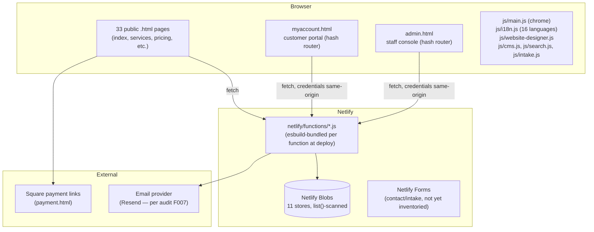
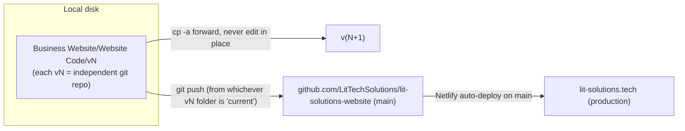

# Architecture — Current State & Target Proposal

Session 0 deliverable. Current-state facts below were built from direct repository inspection (this workspace, copied from `v23`) plus an Explore-agent inventory pass; nothing here is invented. Target proposal is Claude's engineering recommendation only — **not executed**, and the primary-datastore choice within it is an owner decision (see `OWNER_DECISIONS.md`).

## 1. Current-state architecture

The live site is a **static, build-less, multi-page HTML application** with a Netlify Functions backend and Netlify Blobs as the only data store. There is no React, no Vite, no bundler, and no client-side router — every URL is a real `.html` file on disk. This is a hard factual correction to the Global Requirements' "Current Infrastructure Principle" (`Product Vision` sheet), which assumes a React/Vite stack that does not exist in this codebase.



### 1.1 Public vs. authenticated boundary

- All 33 top-level `.html` pages are public and statically served (no auth check at the CDN/static layer — Netlify serves the file to anyone).
- `myaccount.html` and `admin.html` are the only authenticated surfaces, and the auth boundary is enforced **entirely client-side-then-function-side**: the HTML/JS loads unauthenticated, then each view's data calls hit `/.netlify/functions/*` which check the `lts_session` cookie server-side. There is no server-side gate on the HTML file itself — an unauthenticated visitor can load `myaccount.html`'s markup/JS, they just can't get data back from the functions.

### 1.2 Customer vs. staff boundary

`admin.html` and `myaccount.html` are **two independent single-file apps**, not a shared shell with role-based views — near-duplicated boilerplate (`esc()`, `el()`, `api()` fetch wrapper, `requireAuth()`, `loadSession()`) exists in both. Both use the same pattern: a hash-based view router (`#dashboard`, `#documents`, etc.) rendering HTML strings into a container.

### 1.3 Authentication & authorization flow

```mermaid
sequenceDiagram
    participant U as Browser
    participant F as Netlify Function
    participant B as Blobs (sessions store)
    U->>F: POST auth-login {email, password}
    F->>B: users.get(email)
    F->>F: scrypt verify (timingSafeEqual)
    F->>B: sessions.set(sessionId, {userId, role, expiresAt})
    F-->>U: Set-Cookie lts_session (HttpOnly, Secure, SameSite=Lax, HMAC-signed, 8h)
    U->>F: GET /documents (Cookie: lts_session)
    F->>F: verify HMAC signature
    F->>B: sessions.get(sessionId)
    F->>F: if role check fails -> 403; else filter records by ownerField === userId
    F-->>U: 200 (own records only) | 401/403
```

- **No organization/tenant concept exists today.** Every resource is owned directly by a single `userId`. `F001` (Customer Organization Provisioning) is a from-scratch build, not an extension.
- Roles today: `customer`, `staff`, `admin` (flat strings on the user record); most handlers collapse `staff`/`admin` into one effective tier. No per-permission granularity, no org-scoped roles — the target `Roles & Permissions` model (6 roles, default-deny, org-scoped) is a genuine gap, not a refinement.
- Authorization is hand-rolled per function (3-line boilerplate repeated in each handler), not middleware — consistent with `SYS-AUTH-002` in spirit (server-side enforcement) but not with `SYS-ARC-002`'s "organize by domain services rather than embedding business rules in handlers."

### 1.4 Data store boundary

Single store type: **Netlify Blobs**, `consistency: "strong"`, wrapped by `netlify/functions/_lib/blob_store.js`. 11 namespaces today: `users`, `sessions`, `tokens`, `content`, `images`, `documents`, `messages`, `favorites`, `notifications`, `ratelimit`, `leads`. All non-key lookups (e.g. "find by customerId") are `list()` + full in-memory scan — no secondary indexes, no relational joins, no transactions across stores.

### 1.5 File storage

Customer documents (`documents` store) and admin images (`images` store) are stored as **base64 data URIs embedded directly in the Blobs JSON record**, not as separate object-storage entries with signed URLs. This works at current scale but does not match the target `SYS-ARC-004` requirement ("private object storage... short-lived signed URLs") and will not scale to the file volumes F014/F015 imply (proposals, agreements, invoices, receipts, screenshots, backups).

### 1.6 Provider boundary

| Provider | Used for | Adapter pattern today |
|---|---|---|
| Netlify Blobs | All persistence | Thin wrapper (`_lib/blob_store.js`), no retry/circuit-breaker |
| Square | Payment links | Direct link-out from `payment.html`; **no webhook integration exists at all** (confirmed in `quote-acceptance` and `referral-program` specs — both note "no payment webhook exists yet") |
| Email (Resend, per audit F007) | Transactional email | Direct calls from `_lib/email.js`; not confirmed as a named sub-processor in the Privacy Policy (open audit finding) |
| Google Calendar | Not yet integrated | Specced only, in `booking-scheduler/REQUIREMENTS.md` (service account + domain-wide delegation, Freebusy API) |

No provider today is wrapped with the typed adapter pattern (timeout/retry/backoff/circuit/degraded-mode/sanitized-logging) that `SYS-ARC-006` and `SYS-API-007` require — this is greenfield work for every Business Care Hub integration.

### 1.7 Build & deployment flow



- **No build command** — `netlify.toml`'s `[build]` block sets only `publish = "."`; Netlify's own `esbuild` bundling applies to individual functions only, not the site.
- **Versioning is folder-copy, not branching.** `vN` -> `v(N+1)` is a full `cp`, "never edited in place" (per the existing `CLAUDE.md`). There is no established feature-branch workflow — this Business Care Hub effort is the first time a long-lived branch (`feature/business-care-hub`, in this dedicated copy) is being used instead of a new `vN` folder. Documented as a deliberate deviation in `DECISION_LOG.md`.
- Version string is hand-`sed`-swept across all 33 public HTML footers on every release (no shared include mechanism) — pre-existing tech debt (audit finding F034), unrelated to but worth knowing before adding a Care Hub version indicator of its own.
- Zero automated tests, zero CI pipeline, zero lint/typecheck tooling exist anywhere in the repository today (confirmed via `find` for eslint/jest/playwright/tsconfig configs — none present; `package.json` has no `scripts` key at all).

## 2. Module-by-module reuse classification (Session 0 task F)

| Module (per master instruction §9.1) | Status | Classification | Notes |
|---|---|---|---|
| React / Vite frontend | **Does not exist** | Missing (premise was wrong) | Global Requirements assume this; reality is static HTML. See §3.1 recommendation. |
| Netlify (hosting/CDN) | Exists | Reusable | No change needed. |
| Netlify Functions | Exists, 12 handlers | Reusable with correction | Solid auth/session pattern; needs domain-service extraction per `SYS-ARC-002`, typed validation, correlation IDs. |
| Netlify Forms | Not yet inventoried in this session | Requires migration (tentative) | `intake.html` posts appear to go through a custom function (`website-designer.js`), not native Netlify Forms — confirm in Session 1/2 before assuming reuse. |
| Netlify Blobs | Exists, 11 stores | Partially reusable / Owner decision required | Fine for current low-relational-complexity data; Business Care Hub's org/ticket/scope/payment relational needs likely exceed what `list()`-scan supports at acceptable latency and query flexibility. See `MIGRATION_PLAN.md`. |
| Customer accounts | Exists (flat, no orgs) | Requires migration | Auth/session/password mechanics are solid and reusable as-is; the **data model** (no organization entity) must be extended, not replaced — F001/F002/F003/F004 build on top of `auth_utils.js`, don't replace it. |
| Staff administration | Exists (`admin.html`) | Partially reusable | Console pattern (hash router, role gate) is reusable as a UX pattern; the code itself is a monolithic single file that should not be extended further without factoring out shared boilerplate. |
| Documents | Exists (`documents.js`) | Partially reusable | Owner/access model reusable; storage-as-base64-in-Blobs does not meet target file-storage requirements (`SYS-ARC-004`) at Care Hub scale — needs a storage strategy decision. |
| Messages | Exists (`messages.js`) | Reusable with correction | Solid two-way thread + staff inbox pattern; F013 can extend this rather than rebuild, once org-scoping is added. |
| Notifications | Exists (`notifications.js`) | Reusable with correction | Clean `createNotification()` export already consumed cross-function; F012 extends this with delivery preferences. |
| Search | Exists (`js/search.js`, `search-index.json`) | Missing (for portal use) | Current search is a public-content search (blog/portfolio), not an authorized cross-entity search over tickets/documents/customers — F011 is new build. |
| Saved searches / Favorites | Exists (`favorites.js`) | Partially reusable | Bookmarks/recently-viewed pattern for public content; F011's "saved views" for staff/customer records is a different, new capability. |
| Translation (i18n) | Exists, 16 languages | Reusable | `js/i18n.js`'s `data-i18n` scanning pattern extends cleanly to new Care Hub pages. |
| RTL support | Exists (`dir` attribute only) | Reusable with correction | Audit finding F023 (open): RTL sets `dir` but layout doesn't mirror — fix before/alongside Care Hub RTL pages. |
| Light/dark theme | Exists (`js/main.js`) | Reusable | No change needed. |
| Website Designer | Exists, fully implemented | Reusable with correction | Direct precedent for F026 (scope/estimate) and F050 (pricing) — see §2.1. Client/server pricing is **intentionally duplicated**, not centralized (no build step to share code) — conflicts with `SYS-ARC-005`/master-instruction §9.3 centralization mandate; needs resolving once a build step exists for the Care Hub. |
| Pricing calculation | Exists, duplicated by design | Requires migration | See above — F050 should absorb and centralize this, not add a third copy. |
| PDF generation | Exists client-side (`jsPDF` via CDN `<script>`, per `website-audit` spec) | Partially reusable | No npm dependency, no server-side PDF generation exists yet — F014/F042/F053's need for server-generated, access-controlled PDFs is new build. |
| Square payment links | Exists (`payment.html`, link-out only) | Requires migration | No webhook integration at all — F028's "reconcile payment state" requirement starts from zero on the reconciliation side. |
| Analytics | Not yet inventoried in this session | Unknown | Not covered by this session's Explore pass; confirm in Session 7 (F054) before assuming anything exists. |
| CMS | Exists (`content.js`, admin-editable blog/portfolio/testimonials/gallery) | Reusable | Unrelated to Care Hub scope directly, but the whole-array-replace pattern + role gate is a fine precedent for `F056` (System Settings & Feature Flags). |
| **9 spec-only feature folders** | Speced, zero code | **Reuse targets, not competing designs** | See §2.1 — read before designing the overlapping Care Hub function. |

### 2.1 Overlap with the 9 pre-existing spec-only features

These already-designed (but unbuilt) features must be read before the corresponding Business Care Hub function is designed, to avoid contradicting decisions Dylan already made in them:

| Care Hub function | Existing spec(s) to read first | Why |
|---|---|---|
| F019 Support/Change Ticket Submission | `project-status/REQUIREMENTS.md`, `leads-dashboard/REQUIREMENTS.md` | Same "customer-submitted record, staff-visible status lifecycle" shape; together ~80% of the plumbing F019/F020 need. |
| F020 Ticket Triage & Routing | `leads-dashboard/REQUIREMENTS.md` | Near-identical staff filter/search/paginate/detail-view pattern — the direct ancestor design. |
| F026 Scope/Estimate Generation | `project-scaffold-generator/REQUIREMENTS.md` | Same "structured data → generated document" plumbing (zip/PDF assembly). |
| F027 Change Order Approval | `quote-acceptance/REQUIREMENTS.md` | Same "external e-sign process tracked as a manual-first status companion" problem; Phase-1/Phase-2 split (cheap manual tracking now, real automation later gated on a paid-plan decision) is a strong template. |
| F028 Payment Request/Reconciliation | `quote-acceptance/REQUIREMENTS.md`, `referral-program/REQUIREMENTS.md` | Both confirm **no payment webhook infrastructure exists at all** — don't assume webhook-driven reconciliation is available by default. |
| F031 Website Registry | `project-status/REQUIREMENTS.md` (fold-together rule), `booking-scheduler/REQUIREMENTS.md` (lead linkage) | Relational-folding and cross-reference patterns are directly reusable. |
| F032 Website Content Change Request | `project-status/REQUIREMENTS.md` | Same status-lifecycle-on-existing-record shape. |
| F035 Website Health Monitoring | `website-audit/REQUIREMENTS.md` | Same check engine, needs a recurring/scheduled wrapper (borrow `lead-followup`'s scheduled-function pattern — the only precedent for background jobs in this codebase). |
| F036 Uptime & Incident Alerting | `website-audit/REQUIREMENTS.md`, `lead-followup/REQUIREMENTS.md` | Check engine + scheduled-function precedent. |
| F040 Performance & Accessibility Snapshot | `website-audit/REQUIREMENTS.md` | Near-total overlap in check categories (mobile viewport, page weight, SEO, a11y, structured data) — recommend reusing the engine, re-scoped from one-time anonymous to recurring authenticated, rather than reimplementing. Same SSRF-protection requirements apply. |
| F044 IT Support Request | `booking-scheduler/REQUIREMENTS.md` | Reusable slot-computation + Google Calendar integration if IT support ever needs appointment scheduling. |
| F050 Pricing/Discount Engine | `referral-program/REQUIREMENTS.md`, Website Designer pricing | Config-record + admin-editor pattern for discount terms; F050 should generalize/absorb the referral-discount config rather than leave two inconsistent discount mechanisms. |

`booking-scheduler`, `lead-followup`, `leads-dashboard`, `project-scaffold-generator`, `project-status`, `quote-acceptance`, `referral-program`, `website-audit` are all **fully-resolved, ready-to-build specs** (only `quote-acceptance` Phase 2 and `website-audit`'s PageSpeed Insights v2 addition are blocked, both on cost/provider decisions). `quote-session` is intentionally client-only (localStorage) and has no Care Hub overlap.

## 3. Target architecture proposal (not executed)

### 3.1 Frontend structure — recommendation, engineering call, not owner-blocking

Since no React/Vite exists to preserve, and the existing build-less pattern actively works against the Global Requirements' TypeScript and centralization mandates (see the Website Designer's duplicated pricing as a concrete example of the cost), the recommendation is:

- Introduce a **minimal build step scoped only to new Care Hub portal code** (TypeScript compiled + bundled via esbuild — already a zero-added-runtime-dependency choice, since esbuild is what Netlify Functions already use). Output ships as plain static JS/CSS files, coexisting with the rest of the site's build-less pages untouched.
- New Care Hub portal pages/routes still follow the existing hash-router-per-HTML-file pattern (required by `netlify.toml`'s catch-all-to-404 redirect, which forecloses path-based client routing without a redirect change).
- Factor the `esc()`/`el()`/`api()`/`requireAuth()`/`loadSession()` boilerplate duplicated between `admin.html` and `myaccount.html` into a shared TypeScript module, compiled once, used by both the existing pages and new Care Hub views.
- This is **not** a full-site rewrite — the 33 public marketing pages stay exactly as they are.

### 3.2 Backend/service structure

- Keep Netlify Functions as the API layer (`SYS-ARC-002` allows this explicitly). Extract domain logic (pricing, entitlement, workflow, priority, approval rules) into pure TypeScript modules under a new `src/domain/` tree, imported by both functions and (via the new build step) the client where pure calculations need to run client-side for UX (e.g. live price preview) — with the server copy remaining the authoritative source, matching the existing Website Designer "cross-check, don't override" convention rather than trying to eliminate all duplication at once.
- Replace the current hand-rolled 3-line auth boilerplate per function with a shared `requireAuth(role, orgScope)` helper — still simple, still no framework, just deduplicated and consistently enforced (`SYS-AUTH-001`/`SYS-AUTH-002`).

### 3.3 Data-store strategy — **owner decision required**, see `OWNER_DECISIONS.md` and `MIGRATION_PLAN.md`

Two viable paths, not decided here:
1. **Stay on Netlify Blobs**, add a hand-rolled secondary-index convention (e.g. `org:{orgId}:tickets` list keys) to keep query patterns bounded as data grows. Lowest cost, no new provider, but caps how relational/reportable the data can become.
2. **Introduce managed PostgreSQL** for the Care Hub's relational entities (organizations, tickets, scopes, approvals, payments, plans), keeping Blobs for what it's already good at (CMS content, session tokens, file blobs). Matches `SYS-ARC-003`'s explicit suggestion, but is a new paid provider — owner-controlled per master instruction §8.

### 3.4 Private file strategy

Move off base64-in-Blobs for anything beyond small images; use signed, short-lived download URLs generated server-side with object-ownership + role checks on every issuance (`SYS-ARC-004`). Provider choice (stay on Blobs' binary support vs. a dedicated object store) is secondary to the primary data-store decision in §3.3 and can follow the same owner review.

### 3.5 Provider adapter strategy

One typed adapter per provider (Square, email, future Google Calendar, future AI) under `src/providers/`, each implementing: auth, environment, timeout, retry/backoff, idempotency, error translation, sanitized logging, health status, disable/degraded behavior — per `SYS-ARC-006`/`SYS-API-007`. Build incrementally, starting with whichever provider the first implemented wave actually touches (email, for F002/F012 notifications).

### 3.6 Audit-event strategy

F008 (Audit Trail & Security Event Logging) needs a dedicated `audit_events` Blobs store (or Postgres table, per §3.3) written by a single shared helper function called from every privileged/financial/contractual/security/deletion action — not ad hoc per-function logging. This is Wave 1 foundational work; nothing later can be verified as "audited" per Global NFR `SYS-NFR-020` without it existing first.

### 3.7 Feature-flag strategy

Extend the existing `content` store's whole-record-replace pattern into a `System Settings, Feature Flags & Content Configuration` (F056) record: a single typed, admin-editable, audited JSON document read by both functions and the client build. No new provider needed.

### 3.8 Testing structure

See `TEST_STRATEGY.md` — starting from zero, this needs a test runner decision (first-ever addition to `package.json`'s `devDependencies`) before any unit test can run. Recommend the lightest-weight option that covers unit + integration + basic E2E without conflicting with the "avoid unnecessary dependencies" bias already established in this codebase (e.g. `node --test` for unit/integration where sufficient, Playwright only if/when true browser E2E is needed).

### 3.9 Migration approach

See `MIGRATION_PLAN.md`.

### 3.10 Deployment approach

See `DEPLOYMENT_PLAN.md`.

## 4. Low-risk development that can start immediately (Session 0 task H)

Once Dylan reviews and Session 1 is authorized, these do not depend on the data-store or any other owner decision above:

- TypeScript domain interfaces for F001–F008 entities (organization, user, membership, role, session, audit event) — pure types, no storage commitment yet.
- Shared `requireAuth()`/`api()`/`esc()`/`el()` client module, extracted from `admin.html`/`myaccount.html` duplication, with tests.
- Route shell / hash-router scaffolding for a new Care Hub entry page, following the existing pattern.
- Accessible shared UI components (form field, error summary, status badge) as plain TS/DOM modules — no framework dependency either way.
- Test scaffolding + first `node --test` run wired up (even with zero real tests yet) so Session 1 isn't the session that also has to solve "how do tests run here."
- Synthetic fixtures for two-organization tenant-isolation testing (Org A / Org B / owner / member / staff / suspended), ready before F001 needs them.
- Requirements traceability tooling (a small script that cross-checks `REQUIREMENTS_TRACEABILITY.md` entries against `REQUIREMENTS_CATALOG.json` IDs).

**Must wait** for owner review: anything touching the primary data store, pricing/plan values, registration policy, or the two open Critical privacy findings (F006/F007).
